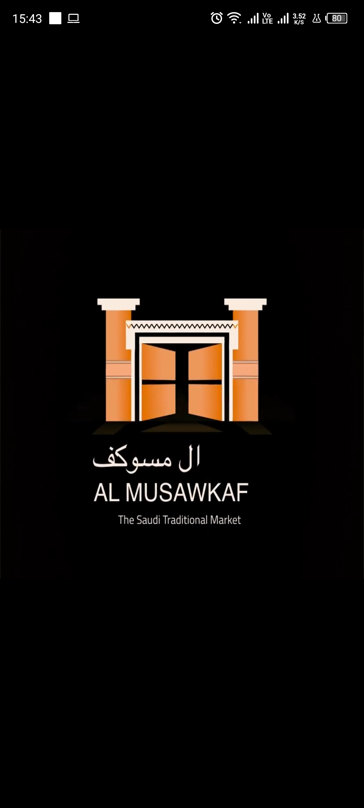
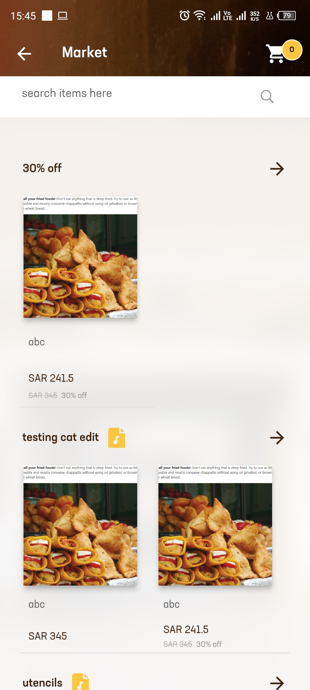

# Al-Musawkaf

INTRODUCTION

AL MUSAWKAF is an AR-based Museum gallery. The system is designed for the traditional marketplace in Saudi Arabic named MUSAWKAF. Using the application, users can scan the items and view their history on a mobile screen, they can purchase specific items using the application. The AR feature of the application allows users to view the traditional majlis on a mobile screen when they point the camera to a specific place designed.

SYSTEM FEATURES

1. View Posted Events
2. Book Seat For Event
3. View Products
4. Place Order
5. View Orders History
6. Augmented View
7. Antique Item History through QR Scan

TECHNOLOGIES/TOOLS USED
1. Flutter
2. Cubit State Management
3. Augmented Reality
4. QR Code Scanning
5. REST APIs
6. Animations
7. Payment Gateway
8. Laravel(php) Server Side (Backend)
9. Adobe Xd (Design Prototype)

SYSTEM SCREENSHOTS

     

                                                              THANKS
